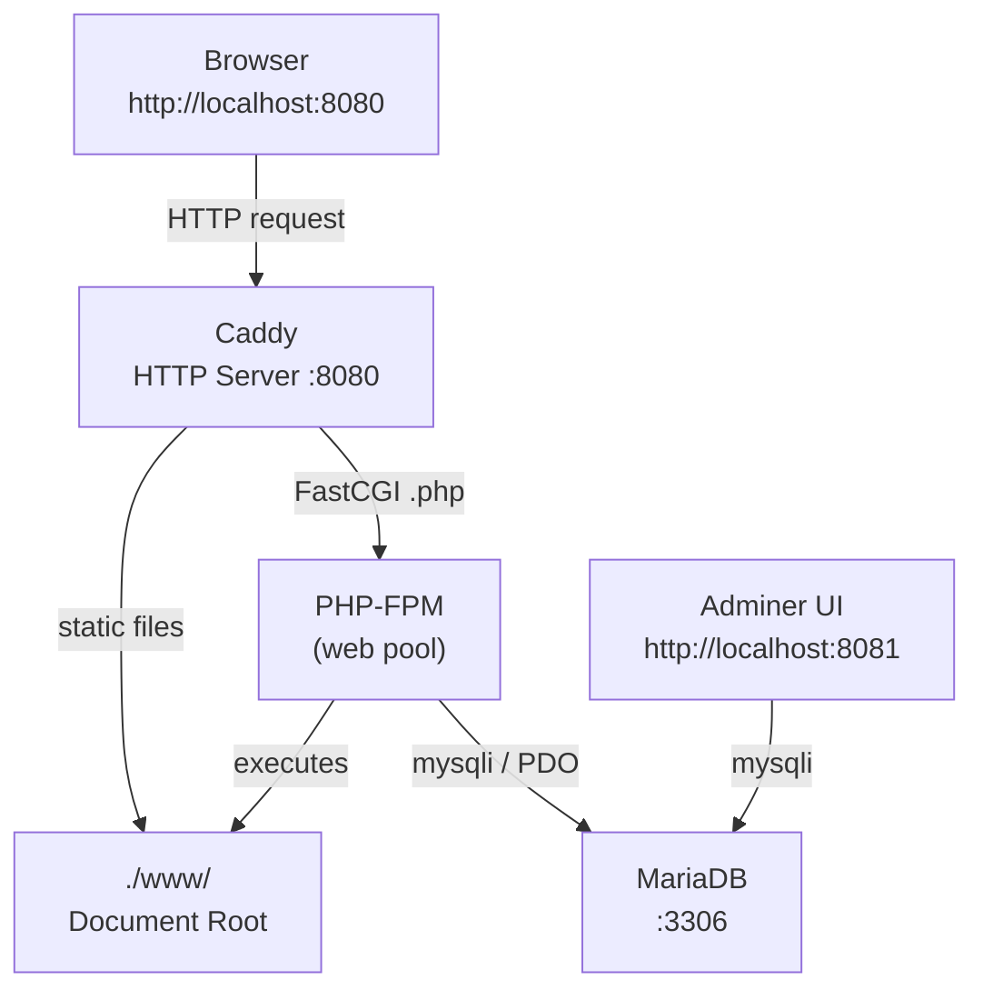
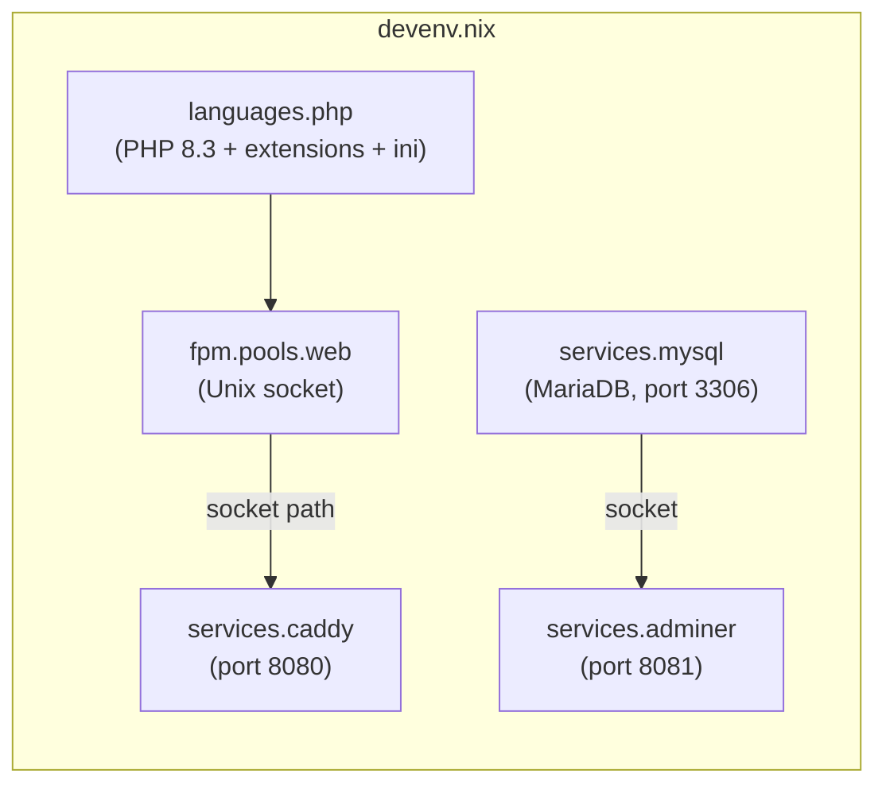
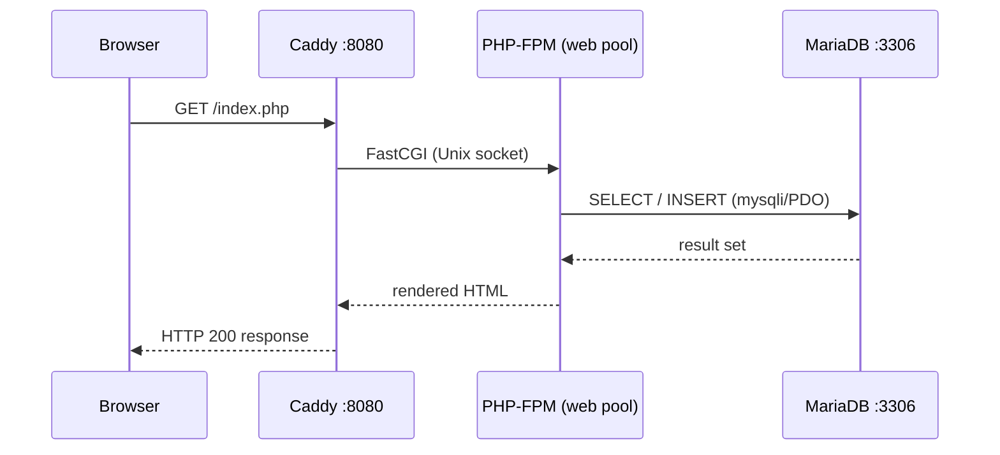
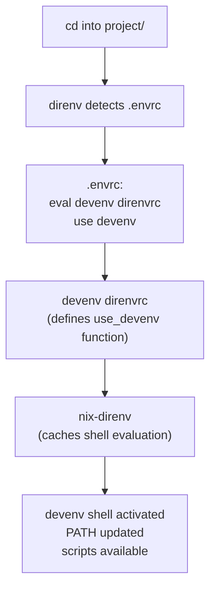

# Architecture

This document explains the nixamp stack: what each tool is, why it was chosen,
how the pieces wire together, and what alternatives were considered.

---

## What is XAMPP

XAMPP is not an application. It is a pre-bundled collection of independent
open-source tools assembled by Apache Friends that collectively provide a local
web development environment. The name is an acronym:

```
X — Cross-platform  (Linux, Windows, macOS)
A — Apache          HTTP server
M — MariaDB         relational database
P — PHP             server-side scripting language
P — Perl            general-purpose scripting language
```

Each tool has a distinct, non-overlapping responsibility. XAMPP pre-configures
them to work together and provides a basic UI to start and stop each service.

nixamp declares the same tools (with some substitutions forced by the devenv
environment) reproducibly via Nix, eliminating the monolithic installer and making
the environment fully version-pinned and portable.

---

## Stack Overview



---

## Tools

### PHP 8.3 + PHP-FPM

**What it is:** PHP is the server-side scripting language this environment exists to run.

In this stack, PHP runs via FPM (_FastCGI Process Manager_) — a separate
daemon that Caddy forwards `.php` requests to over a Unix socket; _PHP-FPM  is the process model used to run PHP — it manages a pool of PHP worker processes that listen on a Unix socket and  execute scripts on demand._

This is the production-preferred architecture and the only mode `devenv` supports.

We also include an `ini` block that sets development-appropriate php.ini overrides globally across all FPM pools in the configured environment.

**Why FPM and not mod_php:** XAMPP uses mod_php, where PHP runs as a module inside
Apache. devenv does not ship Apache, and the alternative — Caddy — communicates with
PHP via FastCGI. The FPM model is actually production-preferred: Caddy and PHP-FPM
are decoupled processes that can be scaled, restarted, and configured independently.

**Extensions loaded:**

Extensions are declared as  simple string names matching `nixpkgs` php extension attributes, within the `languages.php.extensions` array/ option.

`tokenizer`, `pdo`, `openssl` are enabled by default in PHP 8.3 — listed explicitly for documentation clarity but safe to include.

| Extension | Purpose |
|-----------|---------|
| `mysqli` | Direct MySQL/MariaDB procedural API |
| `pdo` | PDO base — database abstraction layer |
| `pdo_mysql` | PDO MySQL/MariaDB driver |
| `mbstring` | Multibyte string handling (UTF-8 safety) |
| `curl` | HTTP requests from PHP |
| `openssl` | SSL/TLS support |
| `tokenizer` | Required by Composer and most frameworks |

Other: `bcmath`, `curl`, `dom`, `mysqlnd`.

Note: `json` is **not** listed. Since PHP 8.0, JSON support is compiled directly
into the PHP core interpreter and cannot be loaded or disabled as an extension.
Attempting to list it as an extension causes an evaluation failure.

---

### Caddy

**What it is:** A modern HTTP server with automatic HTTPS, minimal configuration
syntax, and first-class FastCGI support. It listens on port 8080 (_non-priviledged to avoid root_), serves static
files directly, and forwards `.php` requests to the PHP-FPM pool via a Unix socket.

It receive HTTP requests and routes them to PHP. The mechanism differs; _instead of mod_php (PHP inside Apache), Caddy uses php_fastcgi to proxy requests to the PHP-FPM pool's Unix socket_.


**Why Caddy and not Apache:** devenv does not ship an Apache service. Caddy is the
available web server. The functional role is identical to Apache in a XAMPP setup —
receive HTTP requests, route them to PHP, return responses.

**Alternatives:**

| Server | Notes |
|--------|-------|
| Apache | XAMPP default. mod_php (PHP inside Apache). Not available in devenv. |
| Nginx | Event-driven, high performance. Uses FastCGI like Caddy. Not in devenv. |
| Caddy | **Used here.** Automatic HTTPS, minimal config, devenv first-class support. |
| `php -S` | PHP's built-in server. Zero config, single-threaded. Dev-only, not representative. |

**On reverse proxies:** Nginx, Caddy, and Traefik can all act as reverse proxies —
a role where a server sits in front of another service and forwards traffic to it.
Nginx and Caddy are web servers that also do reverse proxying. Traefik is a reverse
proxy and load balancer first, used primarily in Docker/Kubernetes environments
(e.g. in front of n8n or other self-hosted services). In this stack, Caddy serves
PHP directly via FastCGI — no reverse proxy role is involved.

---

### MariaDB

**What it is:** A relational database server. Stores structured data in tables. PHP
talks to it via `mysqli` or `PDO` to read and write application data.

**Why MariaDB:** MariaDB is a fully compatible MySQL fork maintained by the original
MySQL developers after Oracle acquired MySQL. It is what XAMPP ships under the M.
devenv's `services.mysql` module accepts `pkgs.mariadb` as its package.

**Provisioned resources:**

| Resource | Value |
|----------|-------|
| Database | `uni_db` |
| User | `cypher` |
| Password | `cypher` |
| Permissions | `ALL PRIVILEGES` on `uni_db.*` |

These are bootstrapped on first `devenv up` via `initialDatabases` and `ensureUsers`,
which are idempotent — they do not re-run on subsequent starts.

**Alternatives:**

| Database | Notes |
|----------|-------|
| MariaDB / MySQL | **Used here.** Standard LAMP stack relational DB. |
| PostgreSQL | More standards-compliant SQL, better for complex queries. |
| SQLite | A file, not a server. Zero setup, good for prototyping. |
| Redis | Key-value store. Not relational — used alongside a primary DB for caching. |

---

### Adminer

**What it is:** A single-file PHP web application providing a browser-based GUI for
MariaDB. Equivalent to phpMyAdmin in capability — table browsing, SQL execution,
import/export, user management. Accessible at `http://localhost:8081`.

Compared to phpMyAdmin, it's far lighter. `devenv` ships a first-class service for it that automatically wires the MariaDB socket when services.mysql is also enabled.

Runs on its own port (8081) via PHP's built-in server — _no Caddy config needed_.

**Why Adminer and not phpMyAdmin:** phpMyAdmin has no stable, declaratively usable
nixpkgs derivation. No `pkgs.phpMyAdmin` attribute exists with a reliable path.

Options are to either roll your own `fetchurl` derivation or avoid it entirely. Adminer covers the same use case cleanly.

Adminer is a single PHP file with a first-class devenv service (`services.adminer`)
that automatically wires the MariaDB socket when `services.mysql` is also enabled.

---

### Perl (inactive)

Perl is the second P in XAMPP. Historically used for CGI web scripts before PHP
displaced it. It is declared as a commented-out block in `devenv.nix` for XAMPP
faithfulness. Not required for this course.

---

## Environment Wiring

### Briefing on the environment wiring:
`devenv` — the tool that reads this file and materialises the environment.
  It wraps Nix's mkShell primitive with a module system that understands
  languages, services, and processes. `devenv up` starts all declared
  services as managed foreground processes. `devenv shell` drops into a
  shell with all declared packages in PATH.

`direnv` — the shell hook that automates environment activation per directory.
  When a .envrc file containing `use devenv` is present, direnv detects it
  on `cd` and activates the devenv shell automatically. On `cd` out, it
  deactivates. nix-direnv provides the Nix-aware backend, caching shell
  evaluations so re-entry is instant rather than re-evaluating the flake.
  Together, direnv + devenv mean the environment is always active exactly
  when and where it's needed — no manual `source` or `export` commands.

### Diagram representations





---

## Shell Activation Chain



**Important distinction:**
- `nix-direnv` provides `use_flake` and `use_nix` — not `use_devenv`
- `devenv direnvrc` provides `use_devenv`
- Both must be present. `eval "$(devenv direnvrc)"` must precede `use devenv` in `.envrc`

---

## Design Decisions

### Apache → Caddy substitution

devenv ships no Apache service. Caddy is the only available web server. The
substitution is transparent for coursework — both serve PHP over HTTP. The wiring
differs (mod_php vs FastCGI) but the developer-facing behaviour is identical:
drop a `.php` file in `./www/`, request it at `http://localhost:8080/file.php`.

### phpMyAdmin → Adminer substitution

phpMyAdmin has no stable nixpkgs derivation. Attempts to use `pkgs.phpMyAdmin` or
`pkgs.phpmyadmin` fail — neither attribute exists in a usable form. Adminer covers
identical functionality and has first-class devenv service support.

### `languages.php.extensions` over `buildEnv`

devenv's native `extensions` string list (e.g. `extensions = [ "mysqli" "pdo" ]`) is
the correct approach for declaring PHP extensions. Using `pkgs.php83.buildEnv`
directly requires exact nixpkgs extension attribute names, which differ from PHP's
extension names in non-obvious ways (`json` being the primary example — compiled into
core, no attribute exists).

### Non-privileged ports

Caddy runs on 8080 and Adminer on 8081 rather than 80 and the default phpMyAdmin path.
This avoids requiring root privileges for port binding in a local dev context.

---

## Known Gotchas

**`json` is not a PHP extension.** Since PHP 8.0, JSON support is compiled into the
PHP core interpreter. It cannot be listed in `extensions` or `buildEnv` — doing so
causes an `undefined variable 'json'` evaluation failure.

**`use_devenv` requires devenv's own direnvrc.** nix-direnv does not provide
`use_devenv`. The `.envrc` must contain `eval "$(devenv direnvrc)"` before `use devenv`
or the activation fails with `use_devenv: command not found`.

**HM module flakes must be imported in every evaluation context.** Any flake input
that contributes Home Manager modules (catppuccin, nix-vscode-extensions, etc.) must
be explicitly imported in both the `nixosConfigurations` HM path and the standalone
`homeConfigurations` path. Missing it in the standalone path causes a silent breakage
that only surfaces when directly evaluating that configuration.
